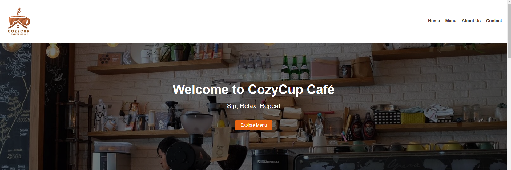
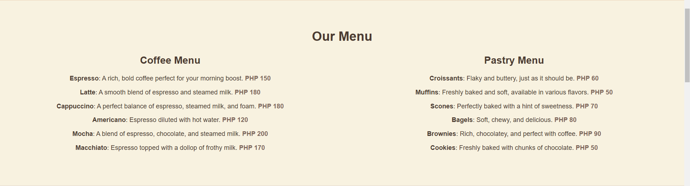
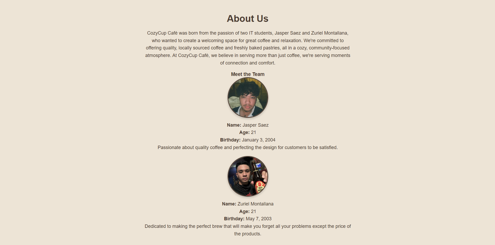
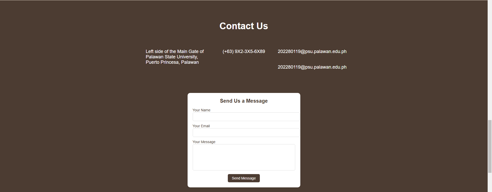

# CozyCup Café

## Project Description
CozyCup Café is a web-based project designed to provide a cozy and inviting atmosphere where coffee enthusiasts can explore a variety of beverages, pastries, and more. It offers an engaging user experience and promotes community connections through quality service.

---

## Features
- **User-Friendly Interface**: Easy navigation across pages for a seamless experience.
- **Rich Menu Options**: Explore an extensive list of coffee and pastry items with detailed descriptions and pricing.
- **Interactive Home Page**: Welcome message and call-to-action buttons.
- **About Us Section**: Learn about the creators and the mission behind the café.
- **Contact Section**: Reach out via form or view location through an embedded map.

---

## Screen Captures

### Home Page

*Description: The hero section welcomes users with a cozy ambiance and a call-to-action button to explore the menu.*

### Menu Page

*Description: Displays coffee and pastry options with pricing details.*

### About Us Page

*Description: Provides insights into the café's mission and introduces the creators.*

### Contact Page

*Description: Users can fill out a contact form, view the café's address, and access an embedded map.*

---

## About the Authors

### Zuriel Montallana

**Name**: Zuriel Montallana  
**Email**: [202280120@psu.palawan.edu.ph](mailto:202280120@psu.palawan.edu.ph)

---

## Social Links
